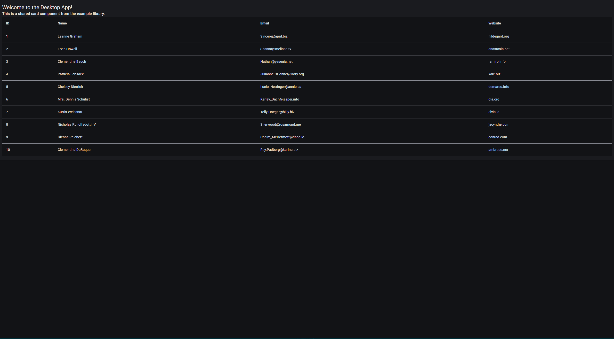
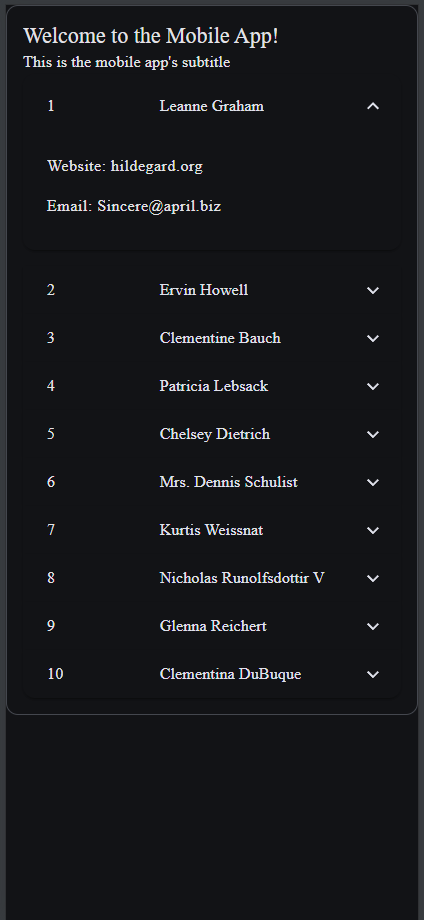

# How to set up the mono repo

1. start with empty workspace:
```
ng new example-workspace --no-create-application
```
2. create desktop application
```
ng g application desktop-app
```
3. create mobile application
```
ng g application mobile-app
```

4. add capacitor:
```
ng add @capacitor/angular
```

5. generate capacitor.config.ts:

```
npx cap init
```

6. turn off telemetry
```
npx cap telemetry off
```

7. add Android and IOS application folders:
```
npx cap add android
npx cap add ios
```

8. create a library for content shared between applications.
```
ng g library example-library
```

which will then add into

This creates the following file structure:
```
example-workspace/
|--android/
|--ios/
|--node_modules/
|--projects/
  |--desktop-app/
    |--public/
    |--src/
  |--mobile-app/
    |--public/
    |--src/
  |--example-library/
    |--src/
      |--lib/
      |--public-api.ts
    |--ng-package.json
    |--package-json
|--capacitor.config.ts
|--package.json
|--angular.json
|--tsconfig.json
```
# How to develop in a monorepo

## Content for specific projects

For content that is unique to the specific project, you develop underneath that subdirectory. For example, you develop any desktop-app specific components inside projects/src/app/...

## Shared content
For shared content, it depends. 

### Styling
If it's styling, simply create it inside the library, then inside the angular.json, add the path to the shared stylings inside of the style node for each project you want the styling to apply.

### Components, Services, Directives
For components, services, and directives, it's a multi-step process.
1. create the component inside of the library's src/lib directory
2. once you are finished, export the Angular object through the library's public-api.ts
   For example, this is what public-api.ts looks like in this example project:
   ```ts
    /*
    * Public API Surface of example-library
    */

    export * from './lib/components/shared-card-component/shared-card-component';
    export * from './lib/services/shared-service';
   ```
3. When the Angular object is ready to be used, build the library like so:
```
ng build example-library
```

After those steps, everything in the library will be importable by any project inside the monorepo. Note that, as long as the library is only used inside the monorepo, you do not need to publish the library to npm.

## how to ng serve a specific project
Here's how to build the desktop-app in this example:
```
ng serve --project=desktop-app
```
That's it. :)

## Building the mobile apps
1. you must build the mobile-app. In this example:
```
ng build mobile-app
```

2. take note of where the build gets stored relative to capacitor.config.ts. For this example project:
```
dist/mobile-app/browser
```

3. Edit the CapacitorConfig like so:

```ts
import type { CapacitorConfig } from '@capacitor/cli';

const config: CapacitorConfig = {
  appId: 'com.example.app',
  appName: 'My Mobile App',
  webDir: 'dist/mobile-app/browser',
};

export default config;
```

4. run:
```
npx cap sync
```

And there you have it! mobile-app is now both an Android and IOS app, located in example-workspace/android and example-workspace/ios, respectively.

You can then look at [Testing your Capacitor App](https://capacitorjs.com/docs/basics/workflow#testing-your-capacitor-app), [Open in your native ide](https://capacitorjs.com/docs/basics/workflow#open-your-native-ide), and [Compiling your native binary](https://capacitorjs.com/docs/basics/workflow#compiling-your-native-binary) for more info on what you can do with the Android and IOS builds.


## Screenshots of the example projects:

### desktop-app:


### mobile-app (emulated on Pixel 7 dimensions):


